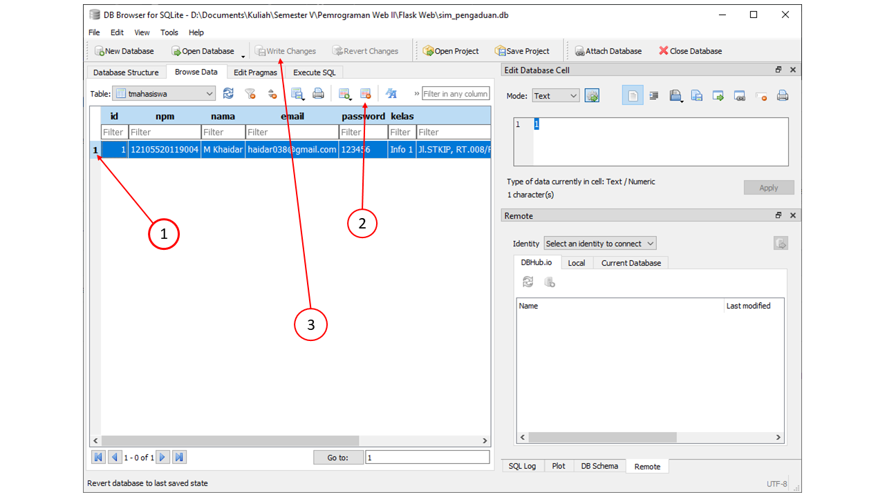
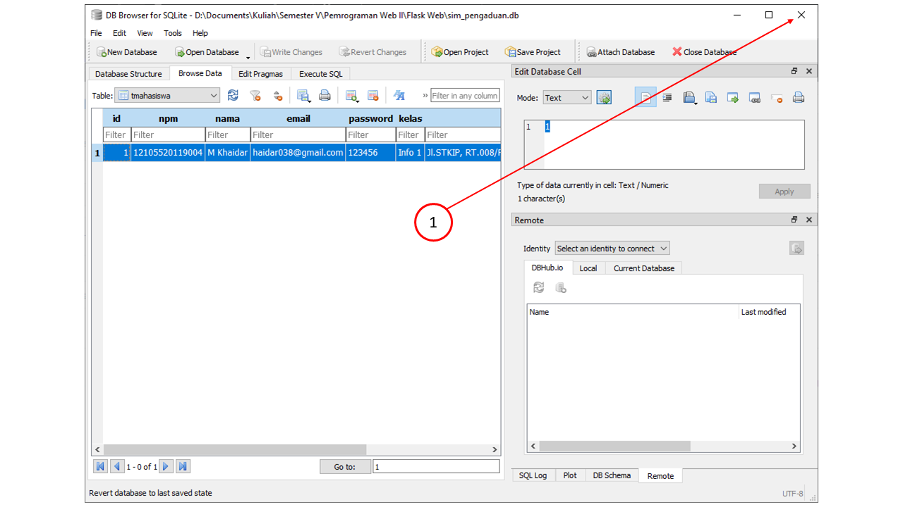

# flask_web
Have a nice day 😀

## Praktikum Part.8 - Database

This is a repository containing my learning progress about the flask website.
For those of you who want to view and download the file or source code in this repo, I invite you.
With a note, the source code inside is only used as a reference to compare the mistakes you made in the project you created with the version I have.

Some important notes you need to know:
- If there is an error with the message "sqlalchemy.exc.Integrityerror: UNIQUE constraint failed: tmahasiswa.email ...." then you must re-check the data you entered as a database table. Because the email is unique, there can be no duplicate or the same email in the new data. For that you have to delete it or use another email.
- 

- If there is an error and the message "Database is locked" while opening the DB Browser application, then you must close the application first to avoid timeouts that occur. After the DB Browser application is closed, please re-enter the data that you will enter in the Student Registration Form.
- 

Note : **"routes.py" untuk folder templates**

### Translate 
Ini adalah repositori yang berisi kemajuan belajar saya tentang situs web flask.
Bagi anda yang ingin melihat dan mendownload file atau source code yang ada di repo ini saya persilahkan.
Dengan catatan, kode sumber di dalamnya hanya digunakan sebagai referensi untuk membandingkan kesalahan yang Anda buat dalam proyek yang Anda buat dengan versi yang saya miliki.

Beberapa catatan penting yang perlu Anda ketahui:
- Jika terdapat error dengan pesan "sqlalchemy.exc.Integrityerror: UNIQUE constraint failed: tmahasiswa.email ...." maka anda harus memeriksa kembali data yang anda masukkan sebagai tabel database. Karena email yang bersifat unik maka tidak boleh ada duplikat atau email yang sama pada data baru. Untuk itu anda harus menghapusnya atau menggunakan email yang lain.
- Jika terdapat error dan bunyi pesan "Database is locked" ketika sedang membuka aplikasi  DB Browser, maka anda harus menutup aplikasi itu terlebih dahulu untuk menghindari timeout yang terjadi. Setelah aplikasi DB Browser ditutup, silakan input kembali data yang akan anda masukkan di Form Registrasi Mahasiswa.
